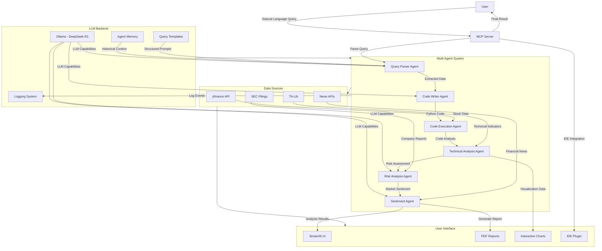

# Quant Agentic AI

A powerful agentic AI system for quantitative financial analysis that processes natural language queries about stocks and generates detailed visualizations and insights using a multi-agent architecture powered by DeepSeek-R1.

## Architecture Overview



## Features

### Phase 1: MVP Upgrade (Complete)

- **Natural Language Interface**: Ask questions about stocks in plain English
- **Multi-Agent Architecture**: Specialized AI agents for different tasks
- **Local LLM Integration**: Powered by DeepSeek-R1 running via Ollama
- **Automated Code Generation**: Generates Python code for stock analysis
- **Data Visualization**: Creates charts and graphs for stock performance
- **Streamlit UI**: User-friendly web interface for query input and result display
- **Agent Memory**: Persistent memory using LangChain to retain context across sessions
- **Technical Indicators**: Integration with TA-Lib for advanced technical analysis
- **Logging & Query Templates**: Structured logging and predefined query templates for common analyses

### Phase 2: Power Users Features (In Progress)

- **PDF Export**: Generate comprehensive PDF reports with analysis findings
- **Risk Analysis**: Dedicated agent for risk assessment and portfolio vulnerability analysis
- **Sentiment Analysis**: Agent that analyzes news and social media sentiment for stocks
- **IDE Plugin Support**: Integration with popular IDEs for seamless developer experience

## Prerequisites

- Python 3.12 or later
- Ollama (for running DeepSeek-R1 locally)
- Docker and Docker Compose (for containerized deployment)

## Quick Start (Docker)

The easiest way to run the project is using Docker:

```bash
# Clone the repository
git clone https://github.com/thuyvinhdinh175/Quant-Agentic-AI.git
cd Quant-Agentic-AI

# Build and start the Docker container
docker-compose up --build -d

# Check logs
docker-compose logs -f
```

## Manual Setup

If you prefer to run the project without Docker:

1. **Install Ollama**

```bash
# For Linux
curl -fsSL https://ollama.com/install.sh | sh

# Pull the DeepSeek-R1 model
ollama pull deepseek-r1:7b
```

2. **Install Dependencies**

```bash
# Using uv (recommended)
uv sync

# Or using pip
pip install -r requirements.txt
```

3. **Configure MCP Server in Cursor IDE**

- Go to Cursor settings
- Select MCP 
- Add new global MCP server with the following configuration:

```json
{
    "mcpServers": {
        "financial-analyst": {
            "command": "uv",
            "args": [
                "--directory",
                "absolute/path/to/project_root",
                "run",
                "server.py"
            ]
        }
    }
}
```

4. **Run the Server**

```bash
python server.py
```

## Usage Examples

Ask the system financial questions like:

- "Show me Tesla's stock performance over the last 3 months"
- "Compare Apple and Microsoft stocks for the past year"
- "Analyze the trading volume of Amazon stock for the last month"
- "Plot YTD stock gain of Tesla"
- "Show me the price-to-earnings ratio for NVIDIA"

## How It Works

1. **Query Parsing**: The system interprets your natural language query to extract stock symbols, timeframes, and analysis actions.
2. **Code Generation**: Based on the parsed query, it generates Python code using yfinance, pandas, and matplotlib.
3. **Execution & Validation**: The generated code is executed and validated to ensure it works correctly.
4. **Visualization**: The system creates charts and graphs to visualize the requested financial data.

## Project Structure

- `server.py`: MCP server implementation that handles incoming queries
- `finance_crew.py`: Multi-agent system using CrewAI for financial analysis
- `streamlit_app.py`: Streamlit web interface for interacting with the system
- `agents/`
  - `query_parser.py`: Agent for parsing natural language queries
  - `code_writer.py`: Agent for generating Python analysis code
  - `execution.py`: Agent for executing and validating code
  - `technical_analysis.py`: Agent for technical indicator analysis
  - `risk_analysis.py`: Agent for risk assessment
  - `sentiment.py`: Agent for news and social media sentiment analysis
- `utils/`
  - `memory.py`: Agent memory implementation
  - `logging.py`: Logging utilities
  - `templates.py`: Query templates
  - `pdf_generator.py`: PDF report generation
- `data/`: Directory for data caching and storage
- `Dockerfile` & `docker-compose.yml`: Containerization configuration
- `pyproject.toml`: Project dependencies and configuration

## License

This project is licensed under the MIT License - see the LICENSE file for details.

## Contribution

Contributions are welcome! Please open an issue or submit a pull request with your improvements.
